# [ArtSea](https://kasia-omm.github.io/art-sea/) - where art and craft meets fun!
### ArtSea was created from the need of alternative party provider in the North West.  Surrounded by the ocean and beautful mountains, Sligo is nuber 1 place to celebrate your special occasion. ArtSea provides fun, creative and different birthday, stag and hen parties as well as corporate or miscellaneous group events. The purpose of this website is to provide information for potential party organisers about the range of services on offer and how to get in touch to enquire or book the event. 

#### Inspired by the colours of ArtSea branding, their unique craft and destory room and considering that 90% of their customer base are women, I chose popular green and pink colours for the main colour theme. The user should straight away be able to recognise the fact that this website is about a business that deals with art through various icons and images resembling art & craft. 

#### The website consists of three pages, giving the first time user an opportunity to get to know ArtSea, learn about sample activities and full range of services on offer. There is also a contact page that allows the user to promptly contact ArtSea for their services.

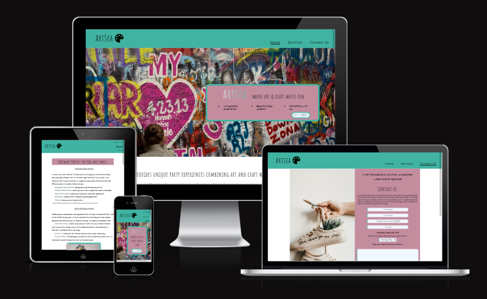

<!-- create table of contents -->

# List of Features

The ArtSea website is designed allowing three pages: index.html representing Home Page, services.html page representing the Services breakdown offered by ArtSea and contact.html allowing for submission Contcat Us form page. Below you will find a list of features for each page.

***The Home page consists of:***

**Navigation Bar**
It is the same navigation bar across all the pages for uniform layout of the website. 

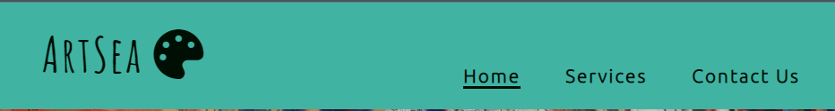

<ol>
    <li>Logo - name ArtSea with icon of a painter's palette</li>
    <li>Menu</li>
<ul>
        <li>Home - the main landing page</li>
        <li>Services - breakdown of party packages on offer</li>
        <li>Contact Us - form for user to fill out</li>
</ul>

Navigation menu is responsive and on smaller screens it changes to vertical for ease of access. There is a possibility to add a hamburger menu for mobile screens in the future. 

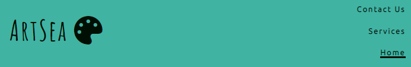

**Hero Image and Main Page Information**

<li>Hero Image - relevant to the business and theme of the website image with text overlay box and repsonsive button</li>
<li>Introduction - short paragraph inviting users to check out the content of Services Page</li>

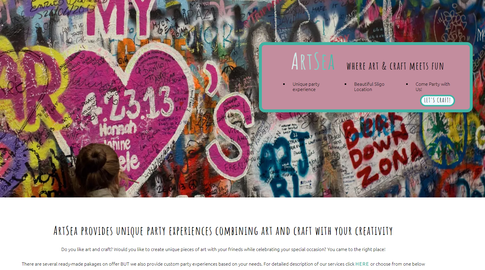

<li>Four buttons that redirect the user to the relevant section of the Services Page</li>

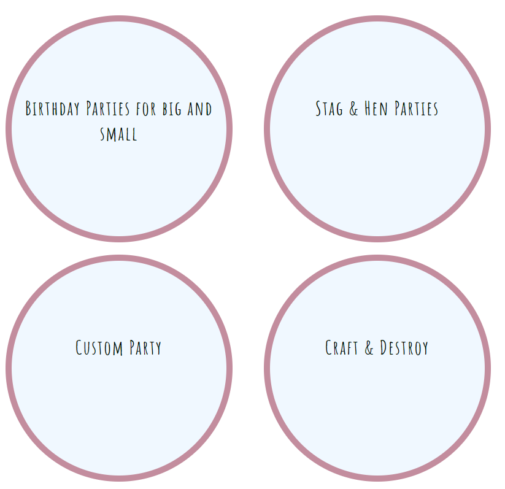
<li>Small gallery - indication of types of art and craft activities on offer</li>

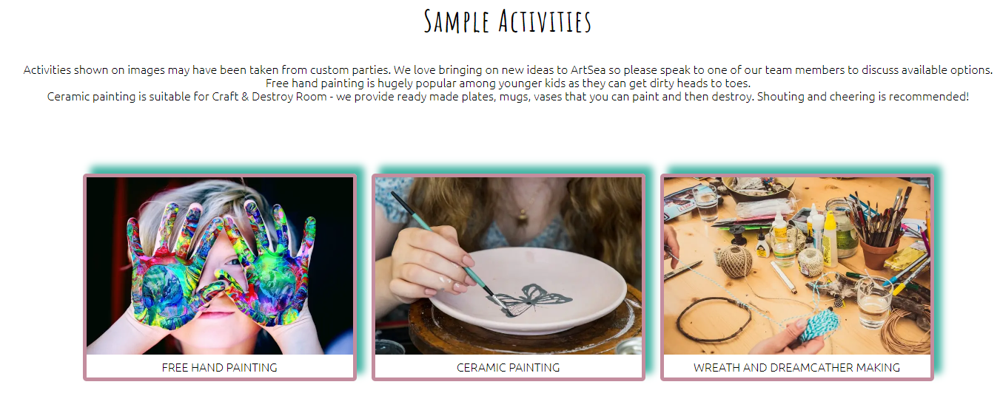

<li>Footer - breakdown of essential information relating to ArtSea such as:
<ul>
        <li>Business logo (name) and address
        <li>Contact Details: redirection to the Contact Us page, Telephone Number and E-mail Address</li>
        <li>Social Media Icons linking to ArtSea social media pages</li>
        <li>Site Map - liks to each page for ease of use</li>
</ul>

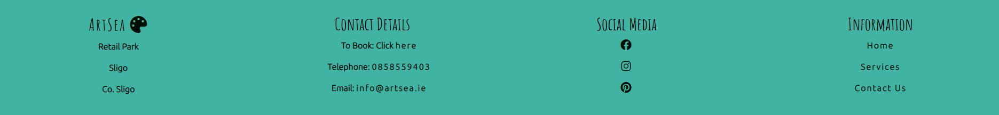
</ol>

<strong>The Services page consists of:</strong>

<ol>
    <li>Logo - name ArtSea with icon of a painter's palette</li>
    <li>Menu</li>
<ul>
        <li>Home - the main landing page</li>
        <li>Services - breakdown of party packages on offer</li>
        <li>Contact Us - form for user to fill out</li>
</ul>
    <li>4 sections - each describing party packages on offer (this section may be expanded as business grows and changes, keeping the same format)</li>
        Section features include:
        <ul>
            <li>text area</li>
            <li>gallery</li>
            <li>embeded videos</li>
        </ul>
Click to view below:

[Services Page](https://kasia-omm.github.io/art-sea/services.html)
    <li>Footer (this footer is also used on Contact Us Page) - breakdown of essential information relating to ArtSea such as:
<ul>
        <li>Business logo (name) and address
        <li>Contact Details: redirection to the Contact Us page, Telephone Number and E-mail Address</li>
        <li>Social Media Icons linking to ArtSea social media pages</li>
        <li>Interactive Map - showing location of the business with possibility of generating directions through Google Maps</li>
</ul>

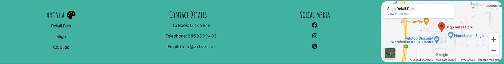
</ol>

<strong>The Contact Us page consists of:</strong>

<ol>
    <li>Logo - name ArtSea with icon of a painter's palette</li>
    <li>Menu</li>
<ul>
        <li>Home - the main landing page</li>
        <li>Services - breakdown of party packages on offer</li>
        <li>Contact Us - form for user to fill out</li>
</ul>
    <li>One section where 50% is allowed for an image and 50% is allowed for a Contact us form (as this form is responsive on smaller screens the image disappears and the form takes the full width of the screen)</li>
    <li>Form includes the following fields:</li>
    <ul>
        <li>First Name - required field</li>
        <li>Second Name - required field</li>
        <li>Mobile Number - required field</li>
        <li>Email Address - required field</li>
        <li>Dropdown list of party options to choose from</li>
        <li>Textarea - allowance of 30 columns and 10 rows</li>

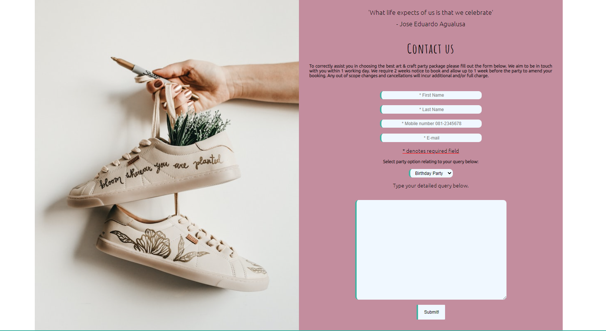
        <li>Responsive Submit button - after user clicks submit, thank you message appears</li>
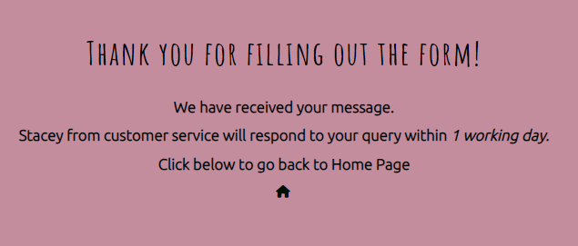
    </ul>

By keeping the same style and format across the website pages, user receives consistency across sections with some elements adapted to the size of the screen for ease of access. The navigation menu remians the same across all pages, the footer changes with the addition of a map on Services and Contact Us pages, which seemed more appropriate for added value to the user. The first page and thank you page have a site map with navigation to other pages. 

Footer contains interactive fields such as telephone number and email. User may click on each field which in return brings them to the calling service provider such as Skype or email provider set as default on their device. This added feature provides additional functionality and provide faster opportunity of potential contact. Copy and paste of telephone number or email is eliminated. Each field opens up in a separate window as per guidelines. 

# UX/UI

## Site Goals

ArtSea site goal is to encourage the user to choose ArtSea for their party. In order to achieve this goal, user must find the navigation through the website quick an easy. According to The Web Content Accessibility Guidelines (WCAG) [WCAG](https://blog.hubspot.com/blog/tabid/6307/bid/30557/6-guidelines-for-exceptional-website-design-and-usability.aspx) websites must be 

Perceivable: Visitors are aware of the content on your site. 
Operable: The functionality of your website should be possible in different ways. 
Understandable: All content and alerts can be easily understood. 
Robust: Your website is usable across different assistive technologies, devices, and browsers. 

>Perceivable: Visitors are aware of the content on your site. 

User is aware of the content of the website as information is clearly laid out, intuitive and presented with high contrast 

>Operable: The functionality of your website should be possible in different ways. 

User is able to operate the website on various size devices, from mobile phones, through tablets and desktops to large screen monitors. All links enclosed within the websites are working and alternative titles are provided if such a case should happen that the link or image was to become broken.

>Understandable: All content and alerts can be easily understood. 

User is able to understand the content and may navigate through photos and videos as required. Videos are not on autoplay and form fields as well as buttons are fully functional. 

>Robust: Your website is usable across different assistive technologies, devices, and browsers. 

Visually impaired user will be able to use a text reader that will have no problem reading out each section of the website with alternative and aria labels provided. 

Summing all up, ArtSea website is accessible for all users.

The navigation of the website attracts the user to navigate to Contact Us form. On the Main Page, there is a link to go directly to Services Page from which user may navigate to Contact Us form after learning about services.

There are several call to action buttons on the Main Page such as 'Let's craft!' on the overlay text box on Hero Image, as well as Contact Us link in the footer.  

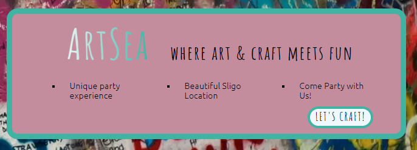

## Design choices

The design of the website focusses on the art and craft part of the business choosing lively colours and images that are in line with branding and general business theme. First time user knows straight away that the website is about party packages that involve creativity and art.

<ol>Theme colors:</ol>
<li>Header and Footer - #41B3A3</li>
<li>Sections title backgrounds - #C38D9E</li>
<li>Button background - aliceblue </li>
<li>Text color - #000F04</li>
<li>Bold text - #384955</li>

The general rule for the website was to keep the navigation menu and footer the same across all pages. The main page footer differs from Services page or Contact Us page, as the objective was to enhance users' experience by making it easier for them to navigate to other pages of the website from the main page. Therfore, the decision was made to include site map with links to other pages on the main page and replace it with Google map on the other two pages. By doing so, user can quickly navigate to other pages and find the location of the business on their navigation journey. This also allows to keep the flow throughout all pages. 

In the footer, for ease of access, links were added to external telephone calling and emailing clients, making it easy for user to contact ArtSea. 

The hero image thatwas chosen for the main page makes the user feel that they landed on the right page if they are looking for art and craft party supplier. It gives the page the urban, freestyle feel and makes the user interested in what ArtSea has on offer. The text overlay brings attention to statements that make the user curious to find out more about this unique experience at ArtSea. It also specifies location so that users that are from far abroad do not waste their time if they landed on the page and are unable to travel thus far. 

The interactive and responsive round buttons on the main page create a clean structured format and bring attention to the services on offer. After clicking, tey bring the user to the required section on the website, without opening in the new tab, allowing for the user to stay on the page as long as possible. 

There was a request to showcase some of the activities offered at ArtSea and this was achieved by creating small galleries with shadow frames keeping the style and colours within the colour palette of the website. Small captions at the bottom of the page explain the activities allowing users to understand what they are. 

The Contact Us page inludes a form, which has required fields specified. Among First and Last Name, there is a phone number, and email address. When it comes to the telephone number, there was a conscious decision made to use input type="text" instead of input type="tel". If tel input type was specified this filed would have been validated and number of different country codes therfore for users' ease of access the field was changed to text with recommended phone number format placeholder. 

## User Stories

**Persona 1** - Parent that wants to organise a birthday party for his/her child, living in Sligo or thin 30 min drive. He/She is looking for party where kids' creativity will be used to have time with their friends and create something they can bring home. The parent is looking for a party where all supplies are provided and minimum effort is required. They want to be able to book the party shortly after consulting the webpage. 

**Persona 2** - Birthday party organiser for partner, friend, parent, children where the birthday is round such as  18th, 21st,30th, 40th, 50th, 60th, 70th, etc. They are looking for party with a twist where the group will spend quality time together, making a piece of art and craft and have fun by possibly destroying it in the Craft and Destroy Room. Suitable for non-drinkers, creative people or those that prefer non-physical activities. Quality time with their party is more important than going out. They are looking for package with meal - allow partner discounts for local restaurant. 

**Persona 3** - Stag and Hen party oraniser, typically brother, sister of best friend. They are looking for a fun, different stag or hen party with the emphasis on the party rather than craft. They would like to incorporate typical symbolic part of the stag and hen party in their package. 

**Persona 4** - Person that was assigned a task of organising a corporate social event with a difference. They were given budget per person and number of people to attend the event. 

**Persona 5** - Group of friends that want to go away for the weekend, having fun, doing something different in a good location. They want to have fun and spend time together. 

>**Persona 1** - Parent that wants to organise a birthday party for his/her child, living in Sligo or thin 30 min drive. He/She is looking for party where kids' creativity will be used to have time with their friends and create something they can bring home. The parent is looking for a party where all supplies are provided and minimum effort is required. They want to be able to book the party shortly after consulting the webpage.

Persona 1 type user of the website will find all the relevant information on the page specifying the age, number of children required for party andprice per person. This user will also find the timeline required to book the party. As this user most likely is juggling several things at once, providing information and ease of access to contact ArtSea to book the party is what they are looking for. 

>**Persona 2** - Birthday party organiser for partner, friend, parent, children where the birthday is round such as  18th, 21st,30th, 40th, 50th, 60th, 70th, etc. They are looking for party with a twist where the group will spend quality time together, making a piece of art and craft and have fun by possibly destroying it in the Craft and Destroy Room. This person wants to accomodate non-drinkers, creative people or those that prefer non-physical activities. Quality time with their party is more important than going out. They are looking for package with meal.

Persona 2 type user wants to be able to book a birthday party that is customised to their needs. This users wants to be able to get in touch to discuss therfore easy access to contact form and telephone number was provided. This user is potentially looking to dine after the party so there is a link given to partner local restaurant giving them the opportunity to book all in one package. Recommended to this user is Craft and Destroy room where party member can destroy piece of craft creating memories for life.

>**Persona 3** - Stag and Hen party oraniser, typically brother, sister of best friend. They are looking for a fun, different stag or hen party with the emphasis on the party rather than craft. They would like to incorporate typical symbolic part of the stag and hen party in their package. 

Persona 3 type user is looking for an activity for their party with a twist. User can quickly navigate to the video of the Craft and Destroy Room on the same page and get in tocuh to discuss the requirements. Sample activities provided in the small gallery in this section allows the user to see what activities were chosen by previous party goers. This in turn helps the user make up their mind. 

>**Persona 4** - Person that was assigned a task of organising a corporate social event with a difference. They were given budget per person and number of people to attend the event.

Persona 4 type of user is the not very common at ArtSea therfore section could be expanded in the future to attract more customers. There is a statement on the website though, that these types of events are also offered and to get in touch through Contact Us form. 

>
**Persona 5** - Group of friends that want to go away for the weekend, having fun, doing something different in a good location. They want to have fun and spend time together.

Persona 5 type user is looking for a custom package. The website allows the user to see that although the activities are chosen by birthday party or stag and hen party goers, they are not occasion specific and may be tailored to their needs. 

Summarising UI/UX section the colcusion is as follows:
<ul>
<li>First time user knows that the website is about art and craft birthday party organiser.</li>
<li>First time user learns about services provided by ArtSea.</li>
<li>First time user is called to action - to book a party.</li>
<li>Firts time user finds contact details to make booking easily.</li>
</ul>

## Wireframes

Wireframes help determine what route to go with the website design. Initially I created them by hand and used them as a reference to what the website should look like. During the design process, some features that looked good on paper, transcribed into other features that simply made more sense after doing some research. I focused on desktop website size during this website design. In the future I will definitely take a mobile first approach and focus on getting the smaller screen size responsiveness limiting the number of css rules as a result. 

Below wireframe was created as a starting point of the design. 

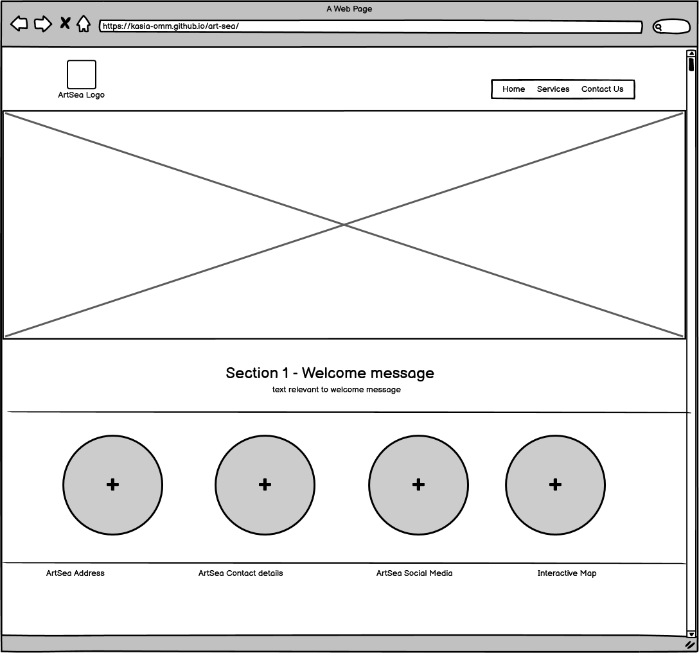

# Testing

Testing the website took plase throughout the design process. It invloved checking if website works on different web browser, wheter it is responsive and if html and css files go through the validation without throwing out any errors. Any errors that were spotted throughout the design are documented in this section. 

As this is a static website, testing is performedon the visual aspect of the website. 
Sections should not overalp, text should be clearly visible and not go out of a specified section. Images should load and if the link for some reason appears to be broken, the alternative description should be displayed. Testing was performed on at least two web browsers and for all screen sizes. Any link included onthe website should direct the user to the correct section of the website. 

The table below represents testing of the website with expected outcome and the actual test result.

### Bug 1
After adding content that was copied from index.html page to  services.html page, the services.html stopped working as per screenshot below:

Bug was fixed by temporarily commenting out code copied from main page info section in the services.html section. I then realised that the codes for the <nav></nav> section contained spaces and services.html page name started with Capital letter. After correcting all those, services.html page started working again.

<em>Note: I realised that website is not deployed and link is breaking each time I open the portal. This bug will need to be fixed once the website is deployed.</em>

<em>Note: After brainstorming with mentor, I came to the conclustion that I shouldn't be using a full http link to the page where user should be directed to, but a relative link instead. Correcting this issue resolved the problem with link breaking.</em>

### Bug 2 

I realised that I downloaded the largest images rather than small so I needed to replace exising images in the assets/images folder to smaller.

### Bug 3 

On main page when I clicked on Lets's party! button, it was opening page in a separate tab but with error 404: File not found as per image below. I fixed it by correcting href link as services.html page name changed from Capital letter to small letter. 

# Deployment

Before deployment may happen, the website is designed in GitHub and GitPod. The following stepse were taken for building ArtSea website:

**To create a GitHub repository follow the steps:**

Step 1: Log in to GitHub 
Step 2: Use template provided by Code Institute by clicking on the link provided [CI Full Template](https://github.com/Code-Institute-Org/gitpod-full-template) 
Step 3: Click on use this template 
Step 4: Create a repository name and add description for the website (name must be unique) 
Step 5: Click create repository from template  
Step 6: Click on GitPod to create a Workspace for your repoitory

**To open workspace in GitPod follow the steps:**

Step 1: Log in to GitPod 
Step 2: Click on your icon and navigate to Workspaces
Step 3: Click on the Workspace you want to work on (inactive workspaces are deleted after 14 days, however if you pushed your code to GitHub, you will be able to open the Workspace again) 
Step 4: Make any required changes to your code and git add . git commit and git push as you go 

**To deploy website on GitHub Pages follow the steps:**

Step 1: Log in to GitHub 
Step 2: Open list of your repositories 
Step 3: Click on the repository you would like to deploy 
Step 4: Click on Settings 
Step 5: Navigate to Pages section 
Step 6: Choose Branch from dropdown list - Main 
Step 7: Click Save 

Deployment may take a longer than expected. You can refresh the page and when a link with "Your site is live" appears, click on it to view your live website. Please note that some websites make take longer to take a full effect of your styling. Please keep refreshing until you reach the desired outcome. If there are differences between you repository in GitPod and deployed website, it would be recommended to check for differences in the code between the two repositories. 

Once the website is depoloyed, if there are any other changes to be made, commands git add. git commit -m and git push must be run in GitPod to view the required changes. 

# Citation of All sources
Images Photo by <a href="https://unsplash.com/@pawel_czerwinski?utm_source=unsplash&utm_medium=referral&utm_content=creditCopyText">Pawel Czerwinski</a> on <a href="https://unsplash.com/s/photos/wave-art?utm_source=unsplash&utm_medium=referral&utm_content=creditCopyText">Unsplash</a>

Photo by <a href="https://unsplash.com/@pawel_czerwinski?utm_source=unsplash&utm_medium=referral&utm_content=creditCopyText">Pawel Czerwinski</a> on <a href="https://unsplash.com/s/photos/wave-art?utm_source=unsplash&utm_medium=referral&utm_content=creditCopyText">Unsplash</a>

Photo by <a href="https://unsplash.com/@szamanm?utm_source=unsplash&utm_medium=referral&utm_content=creditCopyText">Piotr Musioł</a> on <a href="https://unsplash.com/s/photos/wall-drawing?utm_source=unsplash&utm_medium=referral&utm_content=creditCopyText">Unsplash</a>

Zdjęcie dodane przez Sharon McCutcheon: https://www.pexels.com/pl-pl/zdjecie/dzieci-wielobarwne-farby-reczne-1148998/ 

Photo by <a href="https://unsplash.com/@emily_webster?utm_source=unsplash&utm_medium=referral&utm_content=creditCopyText">Emily Webster</a> on <a href="https://unsplash.com/s/photos/crafting-people?utm_source=unsplash&utm_medium=referral&utm_content=creditCopyText">Unsplash</a>

https://blog.logrocket.com/five-cool-css-header-styles-with-cross-browser-compatibility/ 

<a href="https://www.flaticon.com/free-icons/wave" title="wave icons">Wave icons created by Freepik - Flaticon</a>

Photo by <a href="https://unsplash.com/@daniellajardim?utm_source=unsplash&utm_medium=referral&utm_content=creditCopyText">Ella Jardim</a> on <a href="https://unsplash.com/s/photos/crafting?utm_source=unsplash&utm_medium=referral&utm_content=creditCopyText">Unsplash</a>

Photo by <a href="https://unsplash.com/@micheile?utm_source=unsplash&utm_medium=referral&utm_content=creditCopyText">micheile dot com</a> on <a href="https://unsplash.com/s/photos/crafting?utm_source=unsplash&utm_medium=referral&utm_content=creditCopyText">Unsplash</a>

Photo by <a href="https://unsplash.com/@grant_durr?utm_source=unsplash&utm_medium=referral&utm_content=creditCopyText">Grant Durr</a> on <a href="https://unsplash.com/s/photos/clay-painting?utm_source=unsplash&utm_medium=referral&utm_content=creditCopyText">Unsplash</a>

Photo by <a href="https://unsplash.com/@lavievagabonde?utm_source=unsplash&utm_medium=referral&utm_content=creditCopyText">Jasmin Schreiber</a> on <a href="https://unsplash.com/s/photos/crafting?utm_source=unsplash&utm_medium=referral&utm_content=creditCopyText">Unsplash</a>
  
Photo by <a href="https://unsplash.com/@jonathanborba?utm_source=unsplash&utm_medium=referral&utm_content=creditCopyText">Jonathan Borba</a> on <a href="https://unsplash.com/?utm_source=unsplash&utm_medium=referral&utm_content=creditCopyText">Unsplash</a>

https://www.w3schools.com/howto/howto_js_topnav.asp

Photo by Vanessa Loring: https://www.pexels.com/photo/children-doing-crafting-7869797/

Photo by Monstera: https://www.pexels.com/photo/happy-black-girl-with-colorful-crown-with-pompoms-7139982/

Photo by <a href="https://unsplash.com/@ibrahimboran?utm_source=unsplash&utm_medium=referral&utm_content=creditCopyText">Ibrahim Boran</a> on <a href="https://unsplash.com/s/photos/birthday-party-art?utm_source=unsplash&utm_medium=referral&utm_content=creditCopyText">Unsplash</a>
  
Photo by <a href="https://unsplash.com/@taelynnmae?utm_source=unsplash&utm_medium=referral&utm_content=creditCopyText">Taelynn Christopher</a> on <a href="https://unsplash.com/s/photos/birthday-party-art?utm_source=unsplash&utm_medium=referral&utm_content=creditCopyText">Unsplash</a>
  
  Photo by <a href="https://unsplash.com/@timmossholder?utm_source=unsplash&utm_medium=referral&utm_content=creditCopyText">Tim Mossholder</a> on <a href="https://unsplash.com/s/photos/birthday-party-art?utm_source=unsplash&utm_medium=referral&utm_content=creditCopyText">Unsplash</a>

  Photo by Teona Swift: https://www.pexels.com/photo/folded-fabric-with-colorful-paints-on-white-background-6850777/

  Photo by <a href="https://unsplash.com/@khachiksimonian?utm_source=unsplash&utm_medium=referral&utm_content=creditCopyText">Khachik Simonian</a> on <a href="https://unsplash.com/s/photos/wings-art?utm_source=unsplash&utm_medium=referral&utm_content=creditCopyText">Unsplash</a>

  This favicon was generated using the following font:

- Font Title: Amatic SC
- Font Author: Copyright 2015 The Amatic SC Project Authors (https://github.com/googlefonts/AmaticSC)
- Font Source: http://fonts.gstatic.com/s/amaticsc/v24/TUZ3zwprpvBS1izr_vOMscG6eb8D3WTy-A.ttf
- Font License: SIL Open Font License, 1.1 (http://scripts.sil.org/OFL))
  
  
# Future Features

Suggested future features:
<ul>
    <li>Testimonial Page - reviews and testimonials received from users, possible link to Trustpilot if used</li>
    <li>Gallery page - Expand gallery by adding more photos from hosted parties</li>
    <li>Suppliers' section - showcase trusted suppliers by including their logos with link to their online stores, possibility to add affiliate links</li>
    <li>Places to Stay - partner up with local hotels/Airbnbs and offer dicsounted accomodation</li>
</ul>

# Summary